# Documentación

## Core del Negocio de Qnave

**Descripción:**

Qnave es una empresa de transporte privado guatemalteca, fundada en el año 2020, que surgió en medio de un contexto de desafíos globales marcados por la pandemia del COVID-19. La compañía nació como una respuesta a la creciente demanda de servicios de transporte, adaptando un modelo de negocio que inicialmente operaba a través de llamadas telefónicas entre usuarios y conductores. Sin embargo, esta modalidad pronto evidenció serias deficiencias en términos de eficiencia operativa y seguridad.

Uno de los principales problemas que enfrentó Qnave fue la inseguridad. Conductores y usuarios comenzaron a verse afectados por la delincuencia organizada, lo que derivó en una ola de asaltos, secuestros exprés y fraudes. Esta situación afectó gravemente la percepción de seguridad tanto de los conductores como de los usuarios, provocando la renuncia de un número significativo de conductores y el desvío de clientes hacia otras empresas competidoras que ofrecían mejores garantías de seguridad.

A medida que estos problemas se intensificaban, la gerencia de Qnave identificó la necesidad urgente de modernizar sus operaciones y mejorar la seguridad del servicio. En este contexto, se planteó el desarrollo de una solución tecnológica avanzada que permitiera, no solo optimizar la eficiencia operativa, sino también garantizar un entorno seguro tanto para los conductores como para los usuarios.

La propuesta de solución tecnológica incluye el desarrollo de una aplicación móvil moderna que facilita la interacción entre usuarios y conductores, bajo un esquema altamente seguro. Entre las mejoras propuestas, se encuentran la verificación estricta de la identidad de los usuarios y conductores, la encriptación de datos sensibles, un sistema de calificación para mejorar la transparencia y confianza en la plataforma, y la implementación de mecanismos que permitan el monitoreo constante de las operaciones para identificar y mitigar cualquier riesgo de seguridad.

El desarrollo de este proyecto busca posicionar a Qnave como líder en el mercado del transporte privado en Guatemala, ofreciendo una plataforma segura, eficiente y sostenible, tanto desde un punto de vista operativo como financiero.

### Requerimientos Funcionales Generales de Qnave

**Descripción:**

A partir del análisis del core del negocio y los desafíos actuales de Qnave, se identifican los siguientes requerimientos funcionales que el sistema debe cumplir. Estos requerimientos son la base sobre la cual se desarrollarán los casos de uso y la arquitectura del sistema, asegurando que el sistema responda adecuadamente a las necesidades de seguridad, eficiencia y experiencia de usuario.

---

**1. Registro de Usuarios:**

- El sistema debe permitir el registro de usuarios mediante la recolección de la siguiente información: nombre completo, fecha de nacimiento, género, correo electrónico, número de celular, fotografía del DPI, contraseña y confirmación de contraseña.
- Opcionalmente, el usuario puede añadir un método de pago en el momento del registro.

**2. Registro de Conductores:**

- El sistema debe permitir el registro de conductores mediante la recolección de la siguiente información: nombre completo, número de teléfono, edad, número de DPI, correo electrónico, papelería completa (CV en formato PDF), fotografía, fotografía del vehículo, número de placa, marca y año del vehículo, género, estado civil, número de cuenta bancaria y dirección de domicilio.

**3. Registro de Asistentes:**

- El sistema debe permitir que el administrador registre asistentes, recopilando los datos necesarios: nombre completo, número de teléfono, edad, número de DPI, correo electrónico, papelería completa (CV), fotografía, género, estado civil, número de cuenta bancaria y dirección de domicilio.

**4. Inicio de Sesión:**

- Los usuarios, conductores y asistentes deben poder iniciar sesión en la plataforma usando su correo electrónico y contraseña.
- Los conductores y asistentes pueden usar un código de trabajador para iniciar sesión.
- Se debe permitir la recuperación de contraseñas a través de un proceso seguro de recuperación de contraseña.

**5. Verificación de Identidad:**

- El sistema debe enviar un correo electrónico para la confirmación de registro de cuenta. Sin la confirmación, el usuario no podrá utilizar la aplicación.

**6. Gestión de Viajes:**

- Los usuarios deben poder solicitar viajes, indicando su punto de partida y destino.
- El sistema debe mostrar una lista de conductores disponibles y permitir que los conductores acepten o rechacen solicitudes de viaje.
- El sistema debe evitar que dos conductores acepten el mismo viaje.

**7. Métodos de Pago:**

- El sistema debe permitir que los usuarios seleccionen su método de pago: tarjeta de crédito o pago en efectivo.
- El sistema debe validar los datos de la tarjeta, incluyendo el número de tarjeta, CVV y fecha de expiración.

**8. Calificación y Comentarios:**

- Los usuarios y conductores deben poder calificar y dejar comentarios después de cada viaje. El sistema debe utilizar un sistema de calificación por estrellas.

**9. Modificación de Información:**

- Los usuarios, conductores y asistentes deben poder modificar su información personal en cualquier momento, con la excepción de la verificación de identidad que será revisada por un asistente.

**10. Gestión de Conductores:**

- Los asistentes deben poder aceptar solicitudes de empleo, verificar la información de los conductores y dar de baja a aquellos que incumplan políticas.
- El sistema debe permitir a los asistentes ver el historial de viajes y las calificaciones de los conductores.

**11. Gestión de Usuarios:**

- Los asistentes deben poder gestionar la información de los usuarios, incluyendo la capacidad de dar de baja a un usuario por comportamiento inapropiado.

**12. Gestión de Ofertas:**

- El asistente debe tener la capacidad de generar ofertas o descuentos para los usuarios.

**13. Bloqueo de Cuentas:**

- El sistema debe bloquear la cuenta de cualquier usuario, conductor o asistente que ingrese incorrectamente su contraseña cinco veces seguidas.
- Un correo electrónico debe ser enviado con las instrucciones para desbloquear la cuenta.

**14. Encriptación de Datos:**

- El sistema debe encriptar todos los datos sensibles, como contraseñas, números de DPI, métodos de pago y cualquier otra información personal para garantizar la seguridad.

**15. Resumen de Ganancias:**

- Los conductores deben poder ver un resumen de sus ganancias diarias, así como un historial de ganancias acumuladas a lo largo del tiempo.

**16. Reportes del Administrador:**

- El administrador debe poder generar reportes sobre las estadísticas de la plataforma, como el número de usuarios, conductores y asistentes, la cantidad de viajes realizados, cancelados y en espera, además de reportes financieros sobre las ganancias de la plataforma.

## CDU de alto nivel

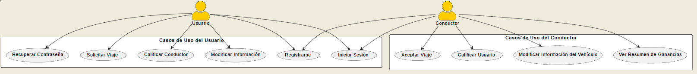
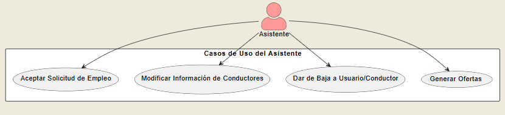
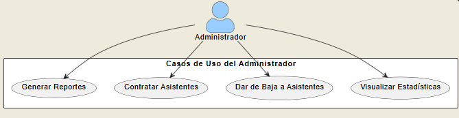

## CDU expandidos

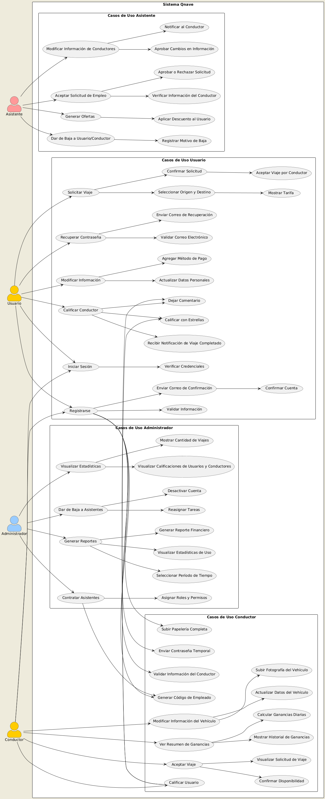

## Aquitectura

## Análisis de Estilos Arquitectónicos para Qnave

El proyecto Qnave busca implementar una aplicación de transporte privado utilizando tecnologías modernas y una arquitectura de software que permita adaptarse a futuros cambios. En este informe, se analizarán varios estilos arquitectónicos y se evaluarán sus ventajas y desventajas para identificar el más adecuado para los objetivos del proyecto.

### 1. **Arquitectura de Microservicios**

- **Descripción**: Esta arquitectura divide la aplicación en servicios pequeños e independientes, cada uno enfocado en una funcionalidad específica (como la gestión de usuarios, pagos o viajes). Los microservicios se comunican entre sí a través de API REST o mensajes.
- **Ventajas**: Ofrece alta escalabilidad y flexibilidad, lo que permite a cada servicio ser desarrollado, desplegado y escalado de manera independiente. Al utilizar Docker, cada servicio puede ser empaquetado en un contenedor aislado, facilitando su administración y despliegue. Además, permite el uso de diferentes lenguajes o tecnologías según la necesidad de cada servicio (Golang para la lógica empresarial, Next.js para la interfaz de usuario, etc.).
- **Desventajas**: La complejidad aumenta al tener que manejar la comunicación entre múltiples servicios y la orquestación de estos. También, se incrementan los costos operativos al requerir más infraestructura para soportar la independencia de cada microservicio.
- **Aplicación en Qnave**: Esta arquitectura es ideal para dividir las funcionalidades del sistema en servicios como autenticación, calificación de usuarios, procesamiento de pagos, etc. Facilitaría la escalabilidad del sistema conforme la demanda de usuarios y conductores crezca.

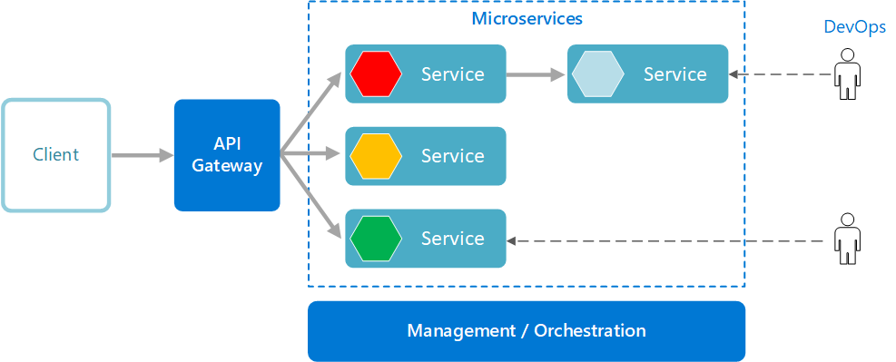

### 2. **Arquitectura en Capas (N-tier)**

- **Descripción**: Se estructura en capas separadas, como presentación, lógica de negocio y acceso a datos. Cada capa tiene una responsabilidad clara y se comunica solo con la capa adyacente.
- **Ventajas**: Proporciona una separación clara de las responsabilidades, lo que facilita el mantenimiento y la reutilización del código. También, permite implementar una lógica empresarial robusta en Golang mientras que la presentación se maneja en Next.js. Es una buena opción cuando se desea mantener un desarrollo más tradicional y organizado.
- **Desventajas**: Puede resultar menos eficiente en términos de rendimiento si las interacciones entre capas son muy frecuentes. Además, no es tan flexible ni escalable como los microservicios, lo que podría limitar el crecimiento futuro del sistema.
- **Aplicación en Qnave**: Esta arquitectura funcionaría bien en el manejo de la lógica empresarial de los procesos, manteniendo las capas separadas y organizadas. Es una opción adecuada si se busca un diseño más clásico y menos complejo.

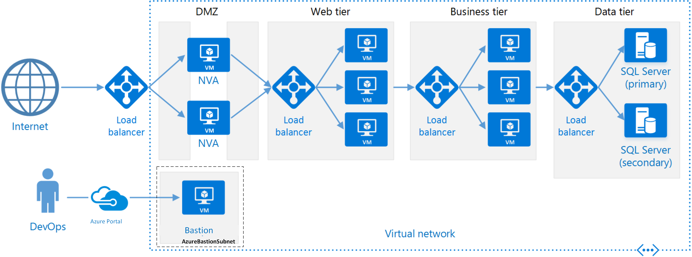

### 3. **Arquitectura Serverless**

- **Descripción**: En esta arquitectura, no es necesario gestionar servidores ya que el proveedor de servicios en la nube (como AWS o Azure) maneja la infraestructura. Los componentes se ejecutan bajo demanda a través de funciones como servicio (FaaS).
- **Ventajas**: Escalabilidad automática y costos bajos, ya que solo se paga por el tiempo de ejecución de las funciones. Es muy adecuada para aplicaciones que dependen de eventos o procesos puntuales.
- **Desventajas**: No es recomendable para procesos largos o que requieren ejecución continua. La personalización y control sobre la infraestructura son limitados.
- **Aplicación en Qnave**: Serverless podría ser útil para manejar tareas específicas, como validaciones de seguridad o procesamiento de pagos. Su integración con los servicios de nube permite una respuesta rápida y un costo ajustado.

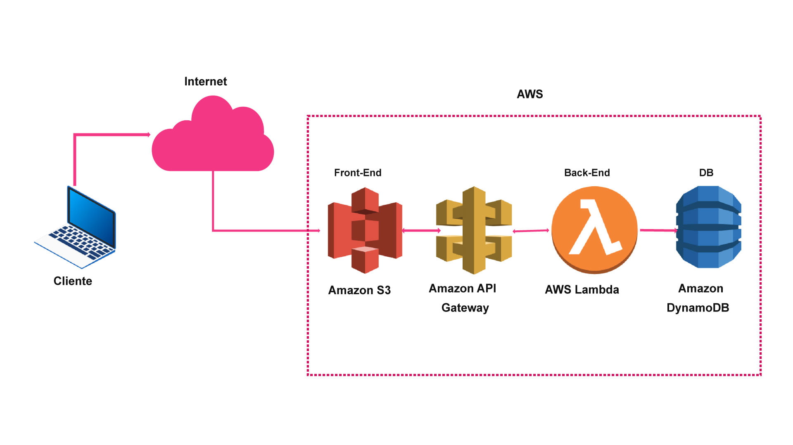

### 4. **Arquitectura Dirigida por Eventos**

- **Descripción**: Está centrada en eventos que desencadenan acciones en los diferentes componentes del sistema. Cada vez que ocurre un evento, los servicios reaccionan en consecuencia.
- **Ventajas**: Muy eficaz para manejar grandes cantidades de solicitudes concurrentes y para gestionar procesos asincrónicos. Es especialmente útil cuando las interacciones entre los usuarios y el sistema son rápidas y frecuentes.
- **Desventajas**: Su implementación puede ser compleja si no se tiene experiencia. Además, si los eventos no se gestionan correctamente, pueden acumularse y ralentizar el sistema.
- **Aplicación en Qnave**: Esta arquitectura es adecuada para manejar eventos como la solicitud de viajes, notificaciones en tiempo real y la creación de usuarios, facilitando la interacción entre los diferentes componentes del sistema.

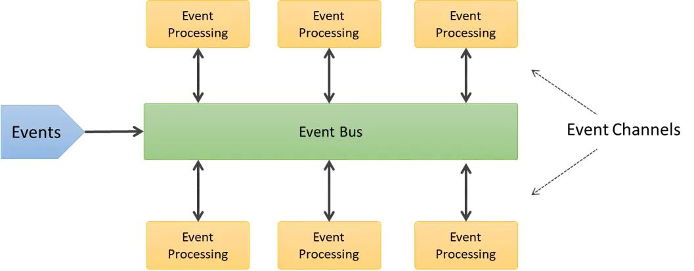

### 5. **Arquitectura CQRS (Command and Query Responsibility Segregation)**

- **Descripción**: Se separan las responsabilidades de lectura y escritura en diferentes modelos, lo que permite optimizar el rendimiento y la escalabilidad.
- **Ventajas**: Permite optimizar las operaciones de lectura y escritura de manera separada. Esto es ideal en aplicaciones que manejan grandes volúmenes de datos y requieren diferentes requisitos de rendimiento para cada operación.
- **Desventajas**: Es más compleja de implementar y mantener, sobre todo en la sincronización de los modelos de lectura y escritura.
- **Aplicación en Qnave**: Podría implementarse para manejar las solicitudes de usuarios (escritura) y la consulta de datos (lectura), utilizando PostgreSQL para operaciones críticas y MongoDB para consultas rápidas.

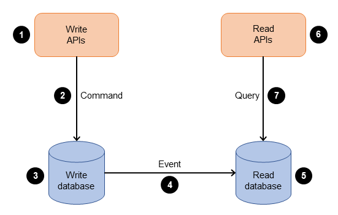

---

## **Selección de estilos arquitectónicos** para Qnave

Basado en el análisis de los diferentes estilos arquitectónicos, hemos seleccionado la arquitectura de **Microservicios** como la opción más adecuada para el proyecto **Qnave**. Este proceso implicó evaluar factores clave como escalabilidad, seguridad y costos, tomando en cuenta las tecnologías que planeamos usar (Docker, PostgreSQL, MongoDB, Next.js, y Golang). A continuación, justifico la elección y expongo las razones que guiarán el desarrollo del sistema.

**Justificación de la Selección:**
La **arquitectura de microservicios** fue seleccionada por varias razones:

1. **Escalabilidad**: Qnave es un sistema con múltiples funcionalidades, desde la autenticación de usuarios y conductores hasta el procesamiento de pagos y gestión de viajes. Con microservicios, cada una de estas funcionalidades se puede implementar como un servicio independiente, lo que permite escalar de manera horizontal. Por ejemplo, si la demanda de gestión de viajes crece, solo necesitamos escalar ese microservicio sin afectar a los demás.
2. **Despliegue Independiente**: Utilizando Docker, podemos aislar cada microservicio en un contenedor. Esto no solo facilita el despliegue, sino que también nos permite realizar actualizaciones y mantenimiento sin interrumpir el funcionamiento de otras partes del sistema. Esta independencia es crucial para un sistema en crecimiento como Qnave, donde la disponibilidad continua es esencial.
3. **Flexibilidad Tecnológica**: Con la arquitectura de microservicios, podemos elegir las mejores tecnologías para cada parte del sistema. Por ejemplo, podemos usar **Golang** para la lógica empresarial crítica, **Next.js** para la interfaz de usuario, y elegir entre **PostgreSQL** y **MongoDB** para las diferentes necesidades de almacenamiento de datos. Esta flexibilidad nos permite optimizar el rendimiento de cada componente del sistema.
4. **Seguridad**: Dado que cada servicio está aislado, podemos implementar medidas de seguridad específicas para cada microservicio. Por ejemplo, podemos encriptar datos sensibles como información de pago o credenciales de usuario en un microservicio de autenticación dedicado, mejorando la protección de datos.
5. **Costos a Largo Plazo**: Aunque inicialmente los microservicios pueden aumentar los costos de infraestructura, esta arquitectura ofrece beneficios a largo plazo. La capacidad de escalar servicios individuales y la posibilidad de optimizar el uso de recursos permiten un manejo eficiente de los costos operativos, lo que es esencial para la sostenibilidad del proyecto.

**Objetivo:**
El objetivo de esta decisión es establecer una arquitectura robusta y flexible que guiará el desarrollo de Qnave. Con la implementación de microservicios, podemos asegurar que el sistema esté preparado para futuras expansiones y cambios, manteniendo un equilibrio entre rendimiento, seguridad y costo. Esta elección permite que Qnave se posicione como una solución tecnológica moderna y eficiente en el mercado de transporte privado, alineándose con las necesidades estratégicas de la empresa.

Documentaremos todo el proceso de implementación, desde la separación de los servicios hasta la configuración de Docker y el manejo de bases de datos, para asegurar que todos los miembros del equipo estén alineados con esta decisión y puedan colaborar efectivamente en el desarrollo del sistema.

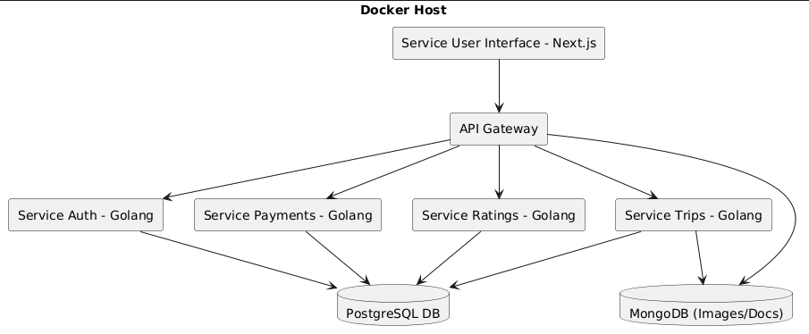

### 1. **Stakeholders vs Requerimientos**

| Stakeholder | Requerimiento 1: Registro de Usuarios | Requerimiento 2: Seguridad del Sistema | Requerimiento 3: Métodos de Pago | Requerimiento 4: Gestión de Conductores | Requerimiento 5: Gestión de Asistentes |
| --- | --- | --- | --- | --- | --- |
| Usuario | ✓ | ✓ | ✓ |  |  |
| Conductor | ✓ | ✓ |  | ✓ |  |
| Administrador |  | ✓ |  | ✓ | ✓ |
| Asistente |  | ✓ |  | ✓ | ✓ |

### 2. **Stakeholders vs Casos de Uso (CDU)**

| Stakeholder | CDU 1: Registro de Usuario | CDU 2: Modificar Información | CDU 3: Solicitar Viaje | CDU 4: Aceptar Viaje | CDU 5: Cancelar Viaje | CDU 6: Calificar Conductores/Usuarios | CDU 7: Gestión de Empleados |
| --- | --- | --- | --- | --- | --- | --- | --- |
| Usuario | ✓ | ✓ | ✓ |  | ✓ | ✓ |  |
| Conductor | ✓ | ✓ |  | ✓ | ✓ | ✓ |  |
| Administrador |  |  |  |  |  | ✓ | ✓ |
| Asistente | ✓ | ✓ |  | ✓ | ✓ | ✓ | ✓ |

### 3. **Requerimientos vs Casos de Uso (CDU)**

| Requerimiento | CDU 1: Registro de Usuario | CDU 2: Modificar Información | CDU 3: Solicitar Viaje | CDU 4: Aceptar Viaje | CDU 5: Cancelar Viaje | CDU 6: Calificar Conductores/Usuarios | CDU 7: Gestión de Empleados |
| --- | --- | --- | --- | --- | --- | --- | --- |
| Req 1: Registro de Usuarios | ✓ |  |  |  |  |  |  |
| Req 2: Seguridad del Sistema | ✓ | ✓ |  | ✓ | ✓ | ✓ | ✓ |
| Req 3: Métodos de Pago | ✓ | ✓ |  |  |  |  |  |
| Req 4: Gestión de Conductores |  |  |  | ✓ | ✓ | ✓ | ✓ |
| Req 5: Gestión de Asistentes |  |  |  |  |  |  | ✓ |

### Requerimientos

1. **Requerimiento 1: Registro de Usuarios**
    - **Descripción:** El sistema debe permitir que los usuarios se registren proporcionando su nombre completo, fecha de nacimiento, género, correo electrónico, fotografía del DPI, número de celular, contraseña y métodos de pago opcionales.
    - **Objetivo:** Asegurar que los usuarios están completamente identificados para poder usar la aplicación.
2. **Requerimiento 2: Seguridad del Sistema**
    - **Descripción:** El sistema debe implementar medidas de seguridad, como la validación de datos, encriptación de información sensible, y bloqueo de cuentas después de múltiples intentos fallidos de inicio de sesión.
    - **Objetivo:** Proteger la información de los usuarios y garantizar la seguridad de las operaciones dentro del sistema.
3. **Requerimiento 3: Métodos de Pago**
    - **Descripción:** El sistema debe permitir a los usuarios registrar tarjetas de crédito o débito, y también debe soportar pagos en efectivo al finalizar el viaje.
    - **Objetivo:** Ofrecer flexibilidad en las opciones de pago para los usuarios.
4. **Requerimiento 4: Gestión de Conductores**
    - **Descripción:** El sistema debe permitir el registro, la validación y la gestión de conductores, incluyendo la posibilidad de dar de baja a los conductores cuando sea necesario.
    - **Objetivo:** Garantizar que los conductores estén registrados de manera segura y puedan ser gestionados eficientemente por los administradores o asistentes.
5. **Requerimiento 5: Gestión de Asistentes**
    - **Descripción:** El sistema debe permitir la contratación y gestión de asistentes por parte del administrador, así como la posibilidad de dar de baja a un asistente cuando sea necesario.
    - **Objetivo:** Facilitar la administración del sistema mediante la asignación de tareas a los asistentes.

---

### Stakeholders

1. **Usuario:**
    - **Descripción:** Persona que utiliza la aplicación para solicitar servicios de transporte privado.
    - **Responsabilidades:** Registrarse en la plataforma, solicitar viajes, calificar conductores y reportar problemas si es necesario.
2. **Conductor:**
    - **Descripción:** Persona que provee el servicio de transporte privado a través de la plataforma.
    - **Responsabilidades:** Registrarse como conductor, aceptar o cancelar viajes, calificar usuarios y reportar problemas.
3. **Administrador:**
    - **Descripción:** Persona responsable de la gestión general de la plataforma, incluyendo la creación y supervisión de los perfiles de usuarios, conductores y asistentes.
    - **Responsabilidades:** Generar reportes, gestionar calificaciones, estadísticas y contrataciones de asistentes.
4. **Asistente:**
    - **Descripción:** Persona encargada de apoyar al administrador en las tareas de gestión y resolución de problemas entre usuarios y conductores.
    - **Responsabilidades:** Aceptar solicitudes de empleo de conductores, dar de baja a usuarios o conductores, generar reportes de vehículos y gestionar ofertas para los usuarios.

---

### Casos de Uso (CDU's)

1. **CDU 1: Registro de Usuario**
    - **Descripción:** Permitir a los usuarios registrarse proporcionando los datos necesarios para su identificación en la plataforma.
    - **Precondición:** El usuario debe tener acceso a un dispositivo con conexión a internet.
    - **Postcondición:** El usuario queda registrado en la plataforma y puede acceder a sus servicios.
2. **CDU 2: Modificar Información**
    - **Descripción:** Permitir a los usuarios y conductores modificar su información personal o agregar métodos de pago.
    - **Precondición:** El usuario debe estar autenticado en el sistema.
    - **Postcondición:** La información del usuario se actualiza en el sistema.
3. **CDU 3: Solicitar Viaje**
    - **Descripción:** Permitir a los usuarios solicitar un servicio de transporte privado desde su ubicación actual a su destino.
    - **Precondición:** El usuario debe estar registrado y autenticado.
    - **Postcondición:** Un conductor es asignado al viaje.
4. **CDU 4: Aceptar Viaje**
    - **Descripción:** Permitir a los conductores aceptar solicitudes de viaje.
    - **Precondición:** El conductor debe estar registrado y autenticado.
    - **Postcondición:** El conductor es asignado al viaje y puede proceder a realizarlo.
5. **CDU 5: Cancelar Viaje**
    - **Descripción:** Permitir a los usuarios o conductores cancelar un viaje antes de su inicio.
    - **Precondición:** El viaje debe estar en curso o programado.
    - **Postcondición:** El viaje se cancela y el sistema notifica al otro participante.
6. **CDU 6: Calificar Conductores/Usuarios**
    - **Descripción:** Permitir a los usuarios y conductores calificar la experiencia del viaje.
    - **Precondición:** El viaje debe haberse completado.
    - **Postcondición:** La calificación se registra en la plataforma.
7. **CDU 7: Gestión de Empleados**
    - **Descripción:** Permitir al administrador y asistentes gestionar el registro y las actividades de los conductores y asistentes.
    - **Precondición:** El administrador o asistente debe estar autenticado en el sistema.
    - **Postcondición:** Los empleados son registrados o dados de baja, y su información es gestionada correctamente.

## Diagrama ER

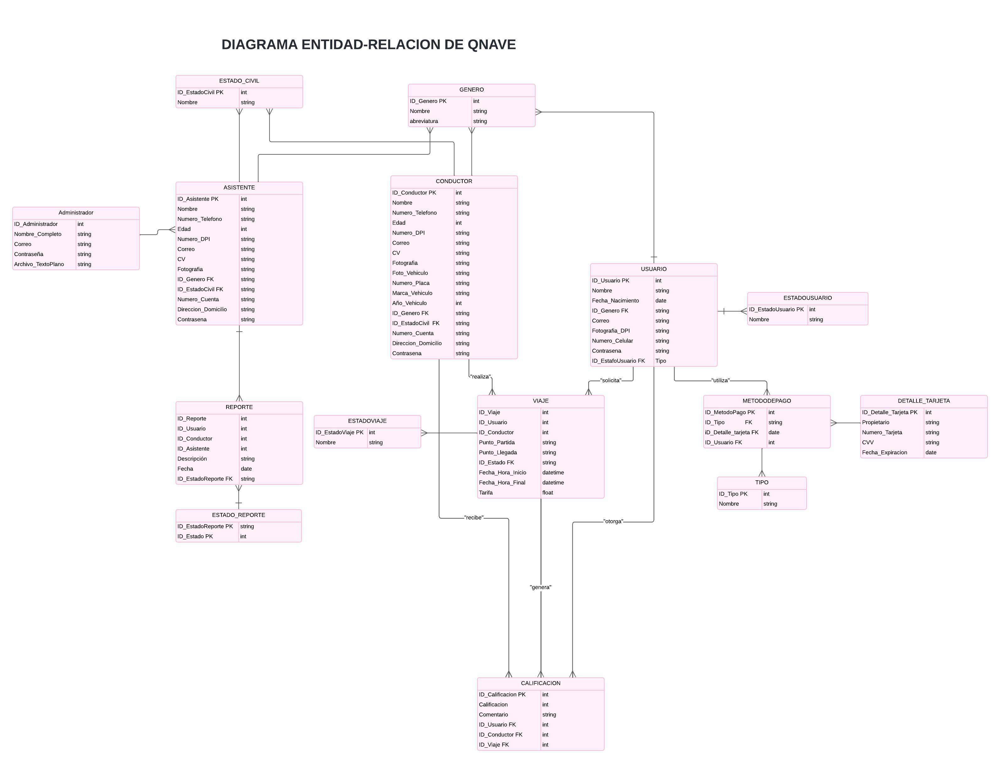

Los patrones de diseño para este proyecto serán:

## Patrones de diseño

## Singleton

Se usará para tener una sola conexión a la base de datos

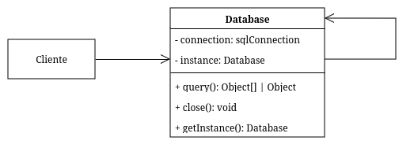

## Factory

Se usará para crear los diferentes tipos de roles en el sistema

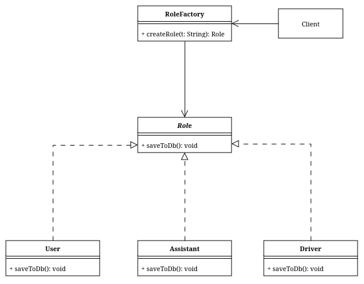

## Strategy

Se usará para seleccionar el tipo de pago para el viaje y realizarlo

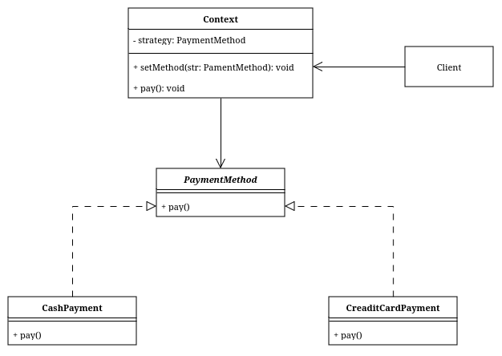

## Decorator

Se usará para añadir la funcionalidad de encriptar la contraseña de los perfiles para los diferentes roles

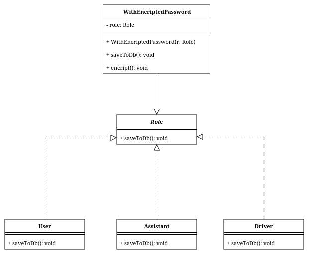

## Fachada

Se usará para “esconder” la llamada de multiples querys a la base de datos a la hora de consultar los reportes del lado del adminsitrador

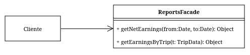

## Wireframes de la Aplicacion

### Inicio de sesión

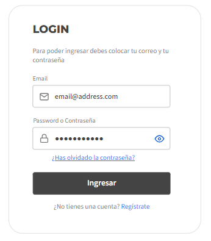

### Registro

### Recuperación de contraseña

### Verificación de Email

### Nueva Contraseña

### Metodos de Pago

### EndPoints

- `POST usuarios/registro`: Registro de usuario.
- `POST usuarios/login`: Inicio de sesión de usuario.
- `POST usuarios/confirmacion`: Confirmación de cuenta vía correo.
- `POST usuarios/recuperar-contraseña`: Recuperación de contraseña.
- `POST conductores/login`: Inicio de sesión de conductor.
- `POST asistentes/login`: Inicio de sesión de asistente.
- `POST administradores/login`: Inicio de sesión de administrador con doble autenticación

## Pantalla Usuario

### Panel Principal

### Solicitar Viaje

### Perfil de Conductor

### Ver Historial de Viaje

### Configuración

### Direcciones Frecuentes

### EndPoints 1

- `PUT /usuarios/perfil`: Modificación de perfil de usuario_pantalla.
- `GET /usuarios/viajes`: Obtener historial de viajes.
- `POST /usuarios/viajes`: Solicitar un viaje.
- `POST /usuarios/calificacion`: Calificar conductor.
- `POST /usuarios/reportar`: Reportar un problema.
- `GET/usuarios/{id}` – Obtener información de un usuario.
- `PUT /usuarios/{id}` – Actualizar información de un usuario.
- `DELETE /usuarios/{id}` – Eliminar usuario.

## Pantalla Conductor

### Panel principal

### Lista de Solicitud de Viajes

### Detalles del Viaje

### Resumen de Ganancias

### Configuración 1

### EndPoints 2

- `PUT /conductores/perfil`: Modificación de perfil de conductor.
- `GET /conductores/viajes`: Obtener lista de viajes disponibles.
- `POST /conductores/viajes/aceptar`: Aceptar un viaje.
- `PUT /conductores/viajes/finalizar`: Finalizar un viaje.
- `POST /conductores/calificacion`: Calificar usuario.
- `GET /conductores/ganancias`: Obtener resumen de ganancias.
- `GET/conductores/{id}` – Obtener información de un usuario.
- `PUT /conductores/{id}` – Actualizar información de un usuario.
- `DELETE /conductortes/{id}` – Eliminar usuario.

## Pantalla Asistente

### Panel principal 1

### Lista de Solicitudes Empleo Conductores

### Lista de Usuarios

### Reportes

### EndPoints 3

- `GET /asistentes/solicitudes`: Obtener solicitudes de empleo de conductores.
- `PUT /asistentes/solicitudes/aprobar`: Aprobar solicitud de conductor.
- `DELETE /asistentes/conductores/{id}`: Dar de baja a un conductor.
- `DELETE /asistentes/usuarios/{id}`: Dar de baja a un usuario.
- `GET /asistentes/reportes`: Obtener reportes de problemas.

## Pantalla Administrador

### Panel principal 2

### Gestión de Asistentes

### Calificaciones

### EndPoints 4

- `GET /api/administradores/estadisticas`: Obtener estadísticas generales de la plataforma.
- `GET /api/administradores/reportes`: Obtener reportes de ganancias.
- `POST /api/administradores/asistentes`: Contratar nuevo asistente.
- `DELETE /api/administradores/asistentes/{id}`: Dar de baja a un asistente.

## Diagrama de despliegue

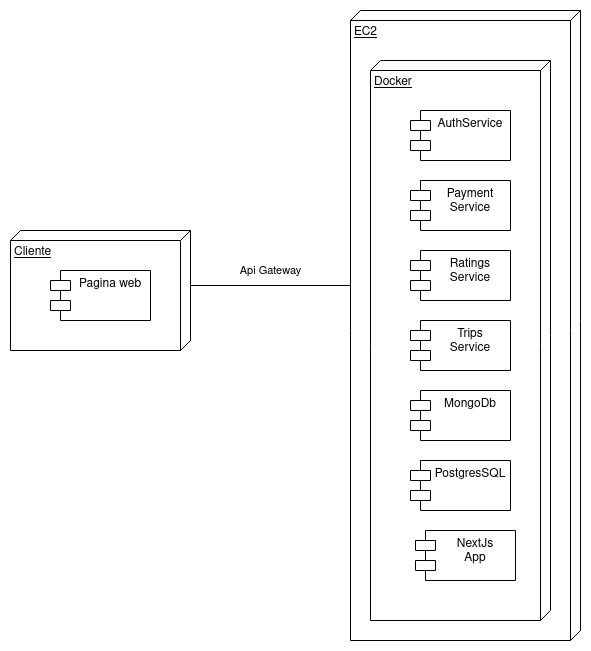

## Pruebas de Aceptación
Pruebas de Aceptación QNave [Accept_Test](https://documenter.getpostman.com/view/29638578/2sAY4sj4cD).
